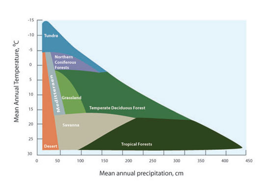
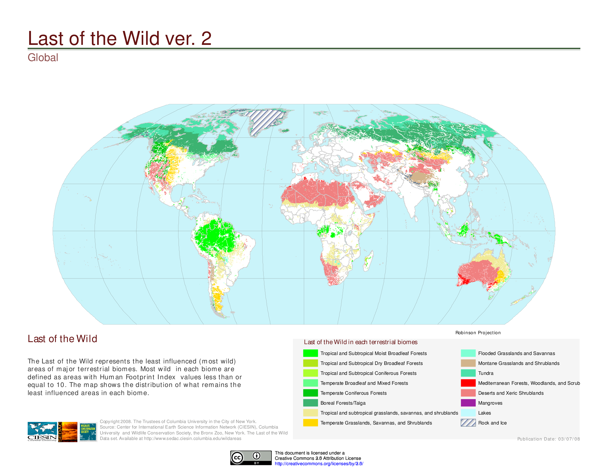
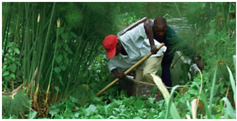
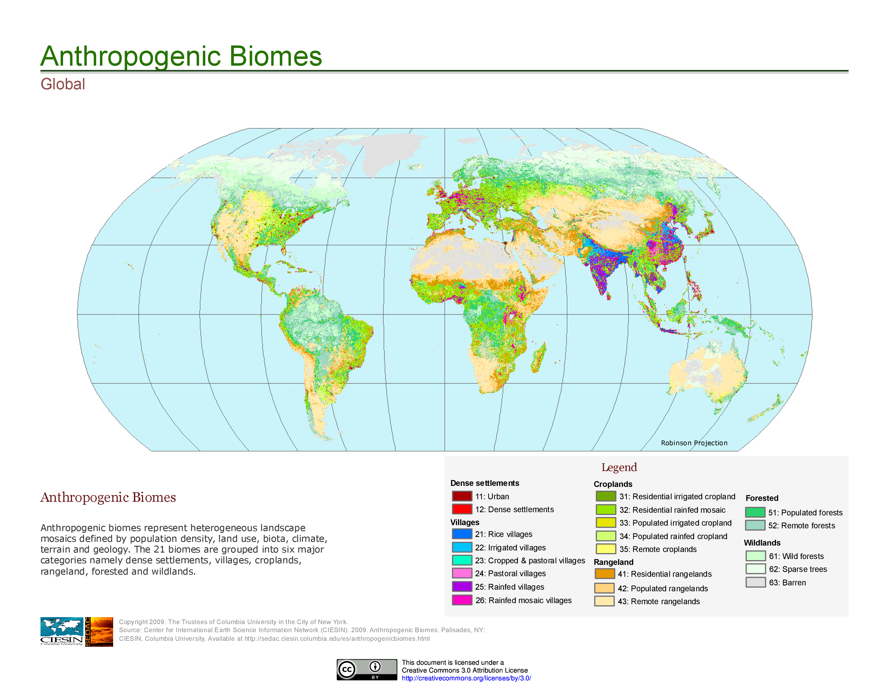
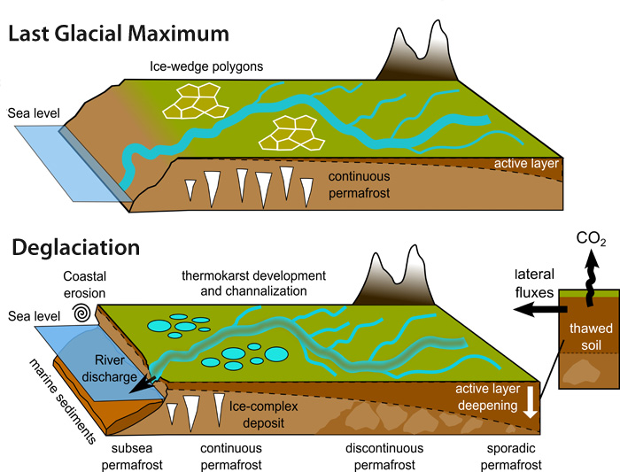

```{r setup, include=FALSE}
knitr::opts_chunk$set(echo = TRUE)
```

```{r infobox1, include=FALSE}
#I've decided to use native R to discuss the syntax and formatting of this example template.  By using include=FALSE in the R chunk definition I have effectively kept it from being included in the final product.  When using this template the template intoduction and all R chunks with "infobox" labels can be removed. 
```
#Climate and Plant Distribution

As the strongest of the five state factors that control ecosystems processes and structure, climate influences plant distribution across the globe through two features: temperature and precipitation. Annual minimum temperature limits the expansion of vegetation when it exceeds a species lethal threshold for survival. For example, at temperatures below -15oC, the probability of intracellular ice formation increases for the majority of broad-leaved, evergreen trees, while conifers from the boreal regions survive at temperatures below -40oC. Although grassland is spread out in a wide range of latitude and altitudes, C3 and C4 grasses respond differently to temperature and moisture, with C4 grasses predominant in tropical and Southern hemisphere latitudes, while C3 grasses prevail in areas with minimum temperatures below 15oC. Cultivated and managed biome often overlap with grasslands, except in the coldest climates.




Approximately one-third of the Earth's land area is covered by trees. Forests store up to 45% of the carbon on land and contributing to balance our planet's carbon budget. Temperature and precipitation influence the types of trees found in different forest biomes.  Latitudes 23.5 degrees N and 23.5 degrees S bound the tropical forest biome (classified by latitude). With the average annual temperature ranging from 20oC to 25oC and the annual precipitation exceeding 2000 mm, tropical forests are characterized by highly diverse flora and the predominance of evergreen broadleaf trees. Located between latitudes 50 and 60 degrees N, boreal forests represent one-third of the forest biome or approximately 11% of world's the land surface. Needleleaf, coniferous (gymnosperm) trees, suitable for temperatures ranging from +5oC to - 5oC and annual precipitation ranging from 40-100 cm, populate the boreal forests.




List of important publications:

Chapin, Matson, and Vitousek (2011) (http://www.springer.com/us/book/9781441995032)
Earth Observatory - Nasa (https://earthobservatory.nasa.gov/Features/ForestCarbon/)
University of California Museum of Paleontology (UC-Berkeley) (http://www.ucmp.berkeley.edu/exhibits/biomes/forests.php#tropical) 
Woodward and Williams (1987) DOI: [10.1007/BF00038700] (https://doi.org/10.1007/BF00038700)
Woodward, Lomas, and Kelly (2004) DOI: [10.1098/rstb.2004.1525] (https://doi.org/10.1098/rstb.2004.1525)

```{r infobox2, include=FALSE}
#above is the first example of inserting an image into your Rmarkdown file.  the '' syntax is used.  You start with an '!'.  Then Within the brakets [] you include the text that you want included as the figure caption.  Then Within the parentheses () you include the link to where the image can be found; the image is from the web in the above example.  I have also nested the link to Schmidts paper's DOI within the figure text which is why it appears complicated.  Below is a similar example with a different image.  Remember you will be copying this template and, though trial and error, it will begin to make sense... and if it doesnt, we'll help you in class. 
```

#Climate change and plant distribution

Recent variations in climate (e.g., snow cover reduction, temperature increase, precipitation variability, etc.) has affected land cover with impact on plant phenology or distribution. Observed changes include advancing in flowering and leafing and the migration of species to higher altitudes. 

Warmer temperatures have contributed to the earlier flowering of cherry trees in Japan and the advancement of tree lines in mountain and alpine regions. Increases in the altitude of the upper limit of treelines have been documented in various locations such as the Swiss Alps and the Southern California's Santa Rosa Mountains, or the Italian Alps. However, the migration of species is bounded by the plant's dispersal abilities. Research on the latitudinal changes of plant distribution, the influence of temperature in lower altitudes is not clear. Although warmer temperatures influence seed production and germination rates, other factors need to be considered including precipitation variability, change in the herbivore population, the increase of wildfires, etc. Nonetheless, warmer temperatures and increased precipitation facilitate the dispersion of alien species. Climate change has contributed for the dispersal of alien grasses such as the cogongrass (Imperata cylindrica) in the Gulf Coast of the United States and other non-native species, such as the water hyacinth (Eichhornia crassipes) in Lake Victoria, Eastern Africa.



To isolate the effects of climate change and land use is not an easy task. Changes in average temperature are correlated to non-climate drivers such as urbanization and pollution, and to socio-economic processes like modifications in land-use (e.g., deforestation for the expansion of agriculture) and land-cover modification (e.g., restoration of an ecosystem). Modifications in land cover affect the intensity of extreme events like heat waves and droughts. Heat Island effect, characterized by extreme temperatures, has been recorded in urban areas, where average temperatures are reportedly more elevated than the surrounding rural areas.  The use of different models to estimate and compare the influence of grasslands and reforestation has provided for conflicting results, and has been criticized for relying on temperature or precipitation, but not in both. Often results are inconsistent with satellite-based observations which estimate more elevated temperatures for cleared areas versus neighboring forests at mid-latitudes. Effects associated with vegetation include the albedo effect and soil carbon sequestration. 



References:

Bertin (2008). DOI: [10.3159/07-RP-035R.1](https://doi.org/10.3159/07-RP-035R.1)
Bradley, Wilcove, and Oppenheimer. (2010). DOI: [10.1007/s10530-009-9597-y](https://doi.org/10.1007/s10530-009-9597-y)
Carlson et al. (2012). DOI: [10.1038/nclimate1702](https://doi.org/10.1038/nclimate1702)
EPA
Forseth, I. (2010) 
Gehrig-Fasel, Guisan, Zimmermann (2007) DOI: [10.1111/j.1654-1103.2007.tb02571.x](http://dx.doi.org/10.1111/j.1654-1103.2007.tb02571.x)
IPCC (2007)(https://www.ipcc.ch/)
IUCN(https://www.iucn.org/resources/issues-briefs/invasive-alien-species-and-climate-change)
Kelly and Goulden (2008). DOI:[10.1073/pnas.0802891105](https://doi.org/10.1073/pnas.0802891105)
Primack, Higuchi, and Miller-Rushing (2009) DOI:[10.1016/j.biocon.2009.03.016](https://doi.org/10.1016/j.biocon.2009.03.016)

#Climate change and permafrost

Permafrost corresponds to soils that stay frozen all year round for over two years in a roll, and it is concentrated around the Artic and Antartic regions. Because permafrost peatlands hold twice as much carbon as what is found in the atmosphere, the thawing of perennially frozen soils allows microbes to convert soil organic matter to methane (CH4) and carbon dioxide (CO2).  The impact of higher temperatures has the potential to release more carbon into the atmosphere than anthropogenic activities have contributed since the industrial revolution.  Another growing concern refers to the speed of soil erosion and the collapse of permafrost and its impact in urban and rural regions from Alaska (US) to Northern Canada to Northern Scandinavia to Siberia (Russia). 



References:

Fidell et al. (2017) DOI: [10.1038/s41467-017-01038-w](https://doi.org/10.1038/s41467-017-01038-w)
Liljedahldo et al. (2016) DOI: [10.1038/NGEO2674](https://doi.org/10.1038/NGEO2674)
National Park Service (https://www.nps.gov/articles/denali-permafrost-carbon.htm?utm_source=article&utm_medium=website&utm_campaign=experience_more)
NOOA Artic Report Card 2017 (http://www.arctic.noaa.gov/Report-Card/Report-Card-2017/ArtMID/7798/ArticleID/694/Terrestrial-Permafrost)
Smithsonianmag.com (https://www.smithsonianmag.com/science-nature/barrow-alaska-ground-zero-for-climate-change-7553696/)
Tarnocai et al. (2006) DOI: [10.1029/2008GB003327](https://doi.org/10.1029/2008GB003327)