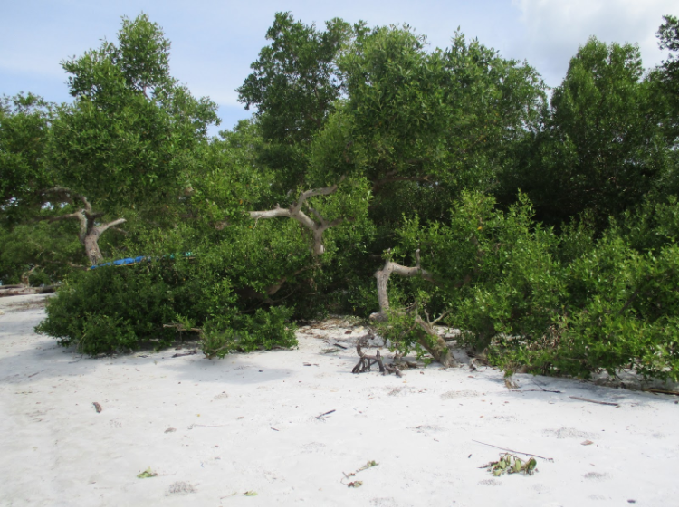
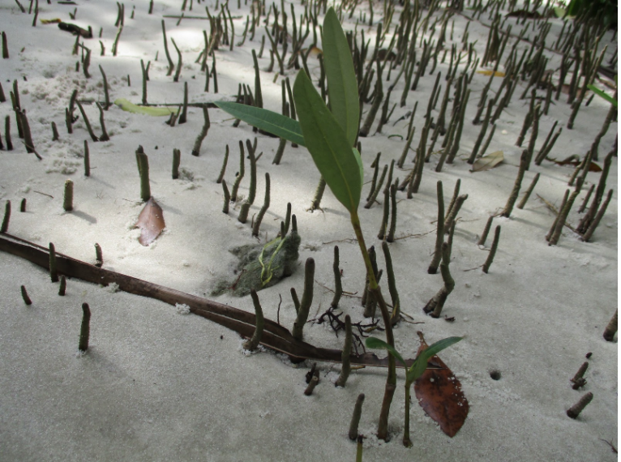

testing text asdlfjadflkjaf 

#What is the role of biomes in the carbon cycle?

Higher concentrations of carbon in the atmosphere lead to more greenhouse effects and warmer temperatures, but does it really matter how much carbon is stored in biomes? Yes, if properly managed carbon stocks above and below ground have the potential of mitigating the carbon emissions from anthropogenic and natural sources.  In fact, more carbon is stored in the world's biomes than in the atmosphere. Vegetation not only affects the carbon cycle through the processes of photosynthesis and respiration, but also when it dies or burns. Understanding plant distribution throughout the globe and its relationship with climate contributes to a better understanding of the potential-and challenges-of managing biomes and their natural carbon pools (or sinks).  

](World_biome_and_carbon_storage.jpg)

](Carbon_cycle.jpg)

Biomes are very large ecological areas defined by climate and other abiotic factors such as soils and vegetation. Globally, the Earth is divided into 7 basic biome types that contain organic carbon pools above and below ground. All biomes affect the carbon cycle, with vegetation playing a key role. While vegetation mostly contributes to reduce the carbon in the atmosphere, that is not always the case. The increase of annual temperatures in the Arctic Circle has the potential of releasing an unprecedented volume of carbon into the atmosphere, leading to a carbon cycle feedback and even warmer annual temperatures. These massive emissions may be offset by the adoption of management practices geared to increase the carbon sequestration in other wild and anthropogenic biomes (e.g., grasslands and croplands). The knowledge of how vegetation and climate interact is essential to estimate future soil organic matter and soil carbon stocks, and to provide information to support decision makers and mitigate undesirable changes in atmospheric concentration of carbon and greenhouse gases (GHG). 

 image to click through the different biome types.](mission.jpg) 

##To learn more check these references:  
Lenton et al. (2008). DOI: [10.1073/pnas.0705414105](http://www.pnas.org_cgi_doi_10.1073_pnas.0705414105)   
Jobbágy & Jackson (2000). DOI: [10.1890/1051-0761](http://onlinelibrary.wiley.com/doi/10.1890/1051-0761(2000)010%5B0423:TVDOSO%5D2.0.CO;2/abstract)  
[NASA](https://earthobservatory.nasa.gov/Features/CarbonCycle/page5.php)  
Schimel et al. (2014). doi: [10.1111/gcb.12822](http://onlinelibrary.wiley.com/doi/10.1111/gcb.12822/abstract)

#How does Climate influence Plant Distribution?

Climate plays a critical role in controlling ecosystems processes and structure. This influence becomes explicit as one uses temperature and precipitation to understand plant distribution.   Annual minimum temperature and water availability limit the expansion of vegetation when it exceeds a species lethal threshold for survival. Although grasslands are present in a wide range of latitudes and altitudes, C3 and C4 grasses respond differently to temperature and precipitation. C4 grasses prefer warmer and wetter climates characteristic of tropical and Southern hemisphere latitudes, whereas C3 grasses prevail in areas with minimum temperatures below 15C. 

](forseth_figure1_ksm.jpg)

](Woodward_C4.png)

](Woodward_C3.png)

Similar behavior also applies to other types of vegetation. Trees cover approximately one-third of the Earth’s land area, with forests storing up to 45% of the carbon on land. However, trees can only thrive in certain ranges of temperature and precipitation thresholds specific for each species.  To illustrate, let's consider the tropical forest biome bounded by the Tropics of Cancer and of Capricorn.  With the average annual temperature ranging from 20oC to 25C and the annual precipitation exceeding 2000 mm, tropical forests are characterized by highly diverse flora and the predominance of evergreen broadleaf trees. The inability of these types of trees to survive at very low temperatures explains why they are not found at higher latitudes, while the abundance of the water leads to larger leafs and higher leaf mass. 
jhgj
](Scatter_graph_trees_Woodward_2004.png)

](Woodward_broadleaf.png)

##To learn more check these references:  

[Chapin, Matson, and Vitousek (2011)](http://www.springer.com/us/book/9781441995032)  
Earth Observatory - [Nasa](https://earthobservatory.nasa.gov/Features/ForestCarbon/)  
[University of California Museum of Paleontology](http://www.ucmp.berkeley.edu/exhibits/biomes/forests.php#tropical) (UC-Berkeley)   
Woodward and Williams (1987) DOI: [10.1007/BF00038700](https://doi.org/10.1007/BF00038700)  
Woodward,Lomas, and Kelly (2004) DOI: [10.1098/rstb.2004.1525](http://rstb.royalsocietypublishing.org/content/359/1450/1465) 

#How does climate change influence plant distribution?

In a reality of increasing global temperatures we are witnessing reduced snow cover, receding glaciers, warmer oceans, amongst other things. The impacts go beyond the natural climate fluctuations, affecting plant phenology and plant distribution, and changing land cover  in differents parts of our planet. In some regions, flowering is happening earlier in the season, in others, species are migrating to higher altitudes.
Increases in the altitude of the upper limit of treelines have been documented in various locations such as the Swiss Alps, Southern California’s Santa Rosa Mountains, and the Italian Alps. Even with warmer temperatures, the migration of species is not ubiquitous because it is bounded by the plant’s dispersal abilities. It is still unclear how the influence of temperature and changes in latitudes affect plant distribution. However, warmer temperatures and increased precipitation has facilitated the dispersion of alien species across the same latitude. Climate change has contributed for the dispersal of alien grasses such as the cogongrass (Imperata cylindrica) in the Gulf Coast of the United States and the water hyacinth (Eichhornia crassipes) in Lake Victoria, Eastern Africa.

](Photo_Lake_Victoria_World_Bank.png)

To isolate the effects of climate change and land use is not an easy task. Changes in average temperature are correlated to non-climate drivers such as urbanization and pollution, and to socio-economic processes like modifications in land-use (e.g., deforestation for the expansion of agriculture) and land-cover modification (e.g., restoration of an ecosystem). Modifications in land cover affect the intensity of extreme events, like heat waves and droughts. Heat Island effect, characterized by extreme temperatures, has been recorded in urban areas where average temperatures are reportedly more elevated than the surrounding rural areas. 

There are different models available and under development to estimate the influence of climate change in different biomes. Due to the complexity of estimating such effects, some studies have provided contradictory results. One of the impacts of modifications in land cover is changes on the albedo effect, resulting in warmer temperatures. For example, changes in landcover affect how much of the Sun's energy is reflected (or not) by the Earth's surface (known aslo as the albedo effect). However, some results are inconsistent with satellite-based observations reporting higher temperatures for cleared areas versus neighboring forests at mid-latitudes.   

Since the 1990s, various research groups have developed computer programs known as Dynamic Global Vegetation Model (DGVM) to simulate the effects of climate change in land cover and in the carbon and water cycles. Here are some examples - the LPJ model (Germany/Sweeden), the IBIS Integrated Biosphere Simulator (U.S.), the MC1 model (U.S.), the BIOMAP model (U.S.), and the SDGVM (U.K.). More advanced earth system models also incorporate feedbacks from shifts in the biosphere to the atmosphere, estimating the impact of changes in terrestrial carbon pools on climate. Feedbacks, both positive and negative, are an important component of models measuring the carbon cycle primarily to infer the future impacts of climate change. Thus, various models focus on estimating the impacts of shifts in areas with elevated carbon storage such as mangrove forests and permafrost soils. 

![Figure 10 - The figure above indicates predictions in vegetation spread across the globe, starting with historical data from 1990, and projecting until the year 2100, using the MC1 DVGM Model. Biomes in the legend: ice (IC), tundra and alpine (UA), boreal conifer forest (BC), temperate conifer forest (TC), temperate broadleaf forest (TB), temperate mixed forest (TM), temperate shrubland (TS), temperate grassland (TG), desert (DE), tropical grassland (RG), tropical woodland (RW), tropical deciduous broadleaf forest (RD), tropical evergreen broadleaf forest (RE). From [Gonzalez et al. (2010)](http://onlinelibrary.wiley.com/doi/10.1111/j.1466-8238.2010.00558.x/abstract)](MC1_Projections.png)

##To learn more check these references: 

Bertin (2008). DOI: [10.3159/07-RP-035R.1](https://doi.org/10.3159/07-RP-035R.1)  
Bradley, Wilcove, and Oppenheimer. (2010). DOI: [10.1007/s10530-009-9597-y](https://doi.org/10.1007/s10530-009-9597-y)  
Carlson et al. (2012). DOI: [10.1038/nclimate1702](https://doi.org/10.1038/nclimate1702)  
[EPA](https://www.epa.gov/)  
Gehrig-Fasel, Guisan, Zimmermann (2007) DOI: [10.1111/j.1654-1103.2007.tb02571.x](http://dx.doi.org/10.1111/j.1654-1103.2007.tb02571.x)  
Gonzalez et al. (2010) DOI: [10.1111/j.1466-8238.2010.00558.x](http://onlinelibrary.wiley.com/doi/10.1111/j.1466-8238.2010.00558.x/abstract)
[IPCC 2007](https://www.ipcc.ch/)    
[IUCN](https://www.iucn.org/resources/issues-briefs/invasive-alien-species-and-climate-change)   
Kelly and Goulden (2008). DOI: [10.1073/pnas.0802891105](https://doi.org/10.1073/pnas.0802891105)    
Nature.com - [Forseth, I. (2010)](https://www.nature.com/scitable/knowledge/library/terrestrial-biomes-13236757)    
Primack, Higuchi, and Miller-Rushing (2009) DOI: [10.1016/j.biocon.2009.03.016](https://doi.org/10.1016/j.biocon.2009.03.016)

#Mangroves are exceptional at carbon sequestration

Mangroves are excellent at carbon sequestration. They absorb above ground carbon from the atmosphere, and transfer it into below ground carbon. Every year, the impacts of climate change and mangrove deforestation in small island communities jeopardize the ability for that excess atmospheric carbon to be absorbed. Carbon is rapidly becoming a hot topic that can be used in future to offset emissions, particularly along shorelines.  The carbon stored in coastal habitats is also known as “Coastal blue carbon”.

The abundance of above and below ground soil organic matter and carbon in vegetation depends directly on the climate or biome type. Climatic changes including fluctuating temperatures, changes in precipitation, and altering of atmospheric processes all affect carbon. Vegetation dependent on climate stability experience dramatic change in canopy, leaf area, and root size, which ultimately can alter carbon source/sink potentials. Climate plays a significant role in not only determining location of these plants, but overall survivorship of ecosystems dependent on them.

](OHI_CARBON_DYNAMIC_11J_KM.png)  

##To learn more check these references: 

Alongi (2014) DOI: [10.4155/cmt.12.20](https://www.researchgate.net/profile/Daniel_Alongi2/publication/274116107_Carbon_sequestration_in_mangrove_forests/links/556b926408aec22683037b84/Carbon-sequestration-in-mangrove-forests.pdf)  
Donato et al. (2011). DOI: [10.1038/ngeo1123](http://dx.doi.org/10.1038/ngeo1123)   
[Hoberg (2011).](http://planvivo.org/docs/UNEP_Economic-Analysis-of-Mangrove-Forests_Case-Study-in-Gazi-Bay_Sept2011.pdf)   
[Metlink - Royal Meteorological Society]( http://www.metlink.org/climate/ipcc-updates-for-a-level-geography/carbon-cycle-feedbacks/)   
[NOOA Fisheries](https://www.fisheries.noaa.gov/insight/coastal-blue-carbon)   
[Spalding (2013)](https://blog.nature.org/science/2013/10/11/new-science-mangrove-forests-carbon-store-map/)   
[The Blue Carbon Initiative](http://thebluecarboninitiative.org/)

#Thawing permafrost increases carbon emissions into the atmosphere

Permafrost soils stay frozen all year round for over two years in a row, and are concentrated around the Artic and Antartic regions. Since permafrost peatlands hold twice as much carbon as the atmosphere, the thawing of perennially frozen soils allows microbes to convert large pools of soil organic matter to methane (CH4) and carbon dioxide (CO2). Thus,  higher annual temperatures have the potential to release more carbon into the atmosphere than anthropogenic activities have contributed since the industrial revolution. Another growing concern refers to the speed of soil erosion and the widespread collapse of permafrost, affecting communities and infrastructure from Alaska (US) to Northern Canada to Northern Scandinavia to Russia. 

](ice-rich-pf.jpg)

](permafrost-deglaciation.jpg)

](Canada_permafrost.png)

##To learn more check these references: 

Fidell et al. (2017) DOI: [10.1038/s41467-017-01038-w](https://doi.org/10.1038/s41467-017-01038-w)  
Liljedahldo et al. (2016) DOI: [10.1038/NGEO2674](https://doi.org/10.1038/NGEO2674)    
[National Park Service](https://www.nps.gov/articles/denali-permafrost-carbon.htm?utm_source=article&utm_medium=website&utm_campaign=experience_more)   
[NOOA Artic Report Card 2017](http://www.arctic.noaa.gov/Report-Card/Report-Card-2017/ArtMID/7798/ArticleID/694/Terrestrial-Permafrost)  
[Schädel, McGuire, and Schuur (2015)](https://www2.nau.edu/schuurlab-p/documents/PCN_5_year_synthesis_report.pdf)    
[Smithsonianmag.com](https://www.smithsonianmag.com/science-nature/barrow-alaska-ground-zero-for-climate-change-7553696/)    
Tarnocai et al. (2006) DOI: [10.1029/2008GB003327](https://doi.org/10.1029/2008GB003327)   

#How to measure the influence of climate on plant distribution?

Scientists have developed various regional and global models to simulate and project changes in plant distribution, temperature and precipitation, carbon emissions, and carbon pools. Species Distribution Models (SDMs), Dynamic Global Vegetation Models (DGVMs), General Circulation Models (GCMs) are broad categories of models used for this purpose. To learn more about models that estimate terrestrial carbon emissions and carbon pools, click here (link to another blog post). 